# JTL Stripe Integration — Data Model Architecture

**Status:** Open architectural decision — needs alignment before further implementation
**Source documents:**
- Stripe Solution Plan for JTL (David Joos, Stripe Solution Architect, March 31, 2026)
- Current JTL Cloud Platform implementation (in development)

> **📚 Document map** (JTL Stripe integration notes):
> - **`overview.md`** — high-level overview: red vs green data model + the real benefits *(this document — start here)*
> - [`solution-docs/md/jtl-billing-connect-solution-plan.md`](./solution-docs/md/jtl-billing-connect-solution-plan.md) — original Stripe Solution Plan (David Joos)
> - [`solution-docs/md/summary.md`](./solution-docs/md/summary.md) — one-page summary of the Solution Plan
> - [`implementation-guide.md`](./implementation-guide.md) — step-by-step implementation guide (the *how*)
> - [`tax.md`](./tax.md) — detailed DACH + EU VAT tax handling (the tax deep-dive)

> **How to read this doc:** the top half (through *Red vs green at a glance*) is the high-level overview — read that for the decision. The lower half (*Detailed differences* onward) is the point-by-point deep dive and reference appendix.

---

## TL;DR

JTL is currently building toward a **per-publisher data isolation model** ("red"), where each Publisher's Express Connected Account holds its own Customers, Products, and Subscriptions.

Stripe's official Solution Plan recommends a **centralized platform model** ("green"), where all Customers, Products, and Subscriptions live on the JTL Platform account, and Connected Accounts are used only as payout destinations via `on_behalf_of` and `transfer_data`.

These two architectures look superficially similar (both have one Connected Account per Publisher) but diverge sharply in customer experience, tax handling, reporting, and operational complexity. The Solution Plan recommendation is significantly better for a B2B SaaS marketplace at scale.

---

## Decision & real benefits

> **In one sentence:** we ran the recommended "green" setup against real Stripe API calls, it works, and for now the **Publisher** (not JTL) is the legal seller — which is the safest, fastest way to launch.

A quick vocabulary refresher before the detail:

- **Merchant of Record (MoR)** — the *legal* seller behind a transaction: the name on the customer's bank statement and invoice, and the entity that owes the tax. Either the **Publisher** or **JTL** can hold this role. ("Publisher-as-MoR" = the Publisher is the seller; "JTL-as-MoR" = JTL is.)
- **Red vs green** — the two data models from the [TL;DR](#tldr). *Red* keeps each publisher's customers, products, and subscriptions siloed inside their own Stripe account; *green* keeps them all on JTL's one central account.
- **POC (proof of concept)** — the throwaway test run saved in `curl-logs/` that exercises the real Stripe calls end to end.
- **`on_behalf_of`** — the single Stripe parameter that names the Publisher as the legal seller. Remove it and JTL becomes the seller instead.

> **POC decision: the Publisher is the Merchant of Record — confirmed and working.**
> The test run in `curl-logs/` follows the money and data through every Stripe object in order — Customer → Subscription → Invoice → Charge → **ApplicationFee** (JTL's commission) → **Transfer** (payout to the Publisher) — with the invoice issued in the Publisher's name.
> This is the lowest-liability, fastest path to launch, it matches what Stripe's Solution Plan asks for, and because it's built on the green model JTL can later switch to being the seller itself **with no data migration**.
>
> Two caveats keep this honest:
> 1. **Tax was switched OFF in every test call.** The POC proves the *plumbing* works — it does **not** prove tax is collected correctly.
> 2. **The "Art. 9a deemed-supplier" question is unresolved** (`tax.md` §6) — an EU VAT rule that can legally force a marketplace to be the seller. It blocks *go-live*, not the POC.
>
> **So: for the POC, the Publisher is the seller. For production go-live, that's conditional on (a) each Publisher registering for tax in the right countries and (b) settling the Art. 9a question.**

**What green is actually for: it centralizes the customer and the money on JTL's account, and it keeps open the option for JTL to become the seller later. It does *not* give you better tax handling or better invoices.** (Grounded in the verified test run in `curl-logs/`, the Solution Plan, and the tax analysis in `tax.md`.)

What green genuinely delivers — and what the Solution Plan asked for ("centralize payments… calculate JTL's commissions… data centralized on the JTL platform's Stripe account"):

1. **One customer, one saved card across every publisher.** Impossible in red. Verified: a single customer record (`cus_xxx`) lives on JTL's account.
2. **Automatic commission with a clean ledger.** Verified end to end: Stripe creates the commission (`ApplicationFee`) and the publisher payout (`Transfer`) automatically — no manual transfer code to write.
3. **One place to report from.** Every subscription, invoice, and charge sits on one account, so JTL's Stripe Dashboard and reporting (Sigma) work out of the box — no pipeline to stitch many accounts together.
4. **Simpler code.** One set of credentials, one webhook stream, one customer per tenant.
5. **Freedom to change who the seller is.** JTL can switch to being the Merchant of Record by removing one parameter (`on_behalf_of`) — a one-line change, not a data migration. This is exactly the Solution Plan's "flexibility to become MoR at a later stage."

What was **oversold** — do **not** use these to justify the move to green:

- **"Centralized tax"** — ❌ not true today. While the Publisher is the seller (`on_behalf_of` is set), Stripe calculates tax against each Publisher's own tax registrations, not JTL's. Tax stays *decentralized* until JTL becomes the seller. **For the full picture — DACH + EU VAT handling, the Art. 9a deemed-supplier question, and per-Publisher registration requirements — see the dedicated [`tax.md`](./tax.md).**
- **"Less onboarding paperwork for publishers"** — ❌ not at launch. With the Publisher as seller, each one still has to pass the full payment-acceptance identity check (`card_payments` KYC) — the same burden as red.
- **"A single JTL-branded invoice"** — ⚠️ only partly. The invoice *data* is centralized, but the invoice is still legally *issued by the Publisher*.

**The twist:** the EU's deemed-supplier VAT rule may force JTL to become the seller whether it wants to or not (`tax.md` §6). If that happens, benefit #5 stops being a nice-to-have and becomes the thing that saves JTL from a painful re-architecture.

**Bottom line:** migrate for unified customer + money + reporting + simpler code + cheap MoR switch. Not for tax or invoices.

---

## The two architectures

### ❌ Current (red) — Per-Publisher Data Isolation



<sub>Source: [`diagrams/red-model.mmd`](diagrams/red-model.mmd) — edit and re-render with `mmdc -i diagrams/red-model.mmd -o diagrams/red-model.svg`</sub>

Each Publisher's Express Connected Account contains:
- Its own Customer objects (one per tenant who bought from this publisher)
- Its own Product/Price objects (the apps the publisher sells)
- Its own Subscription objects (the active subscriptions for this publisher's apps)

The JTL Platform account has minimal data — it mostly exists to administer Connected Accounts.

### ✅ Recommended (green) — Centralized Platform Model (per Stripe Solution Plan)



<sub>Source: [`diagrams/green-model.mmd`](diagrams/green-model.mmd) — edit and re-render with `mmdc -i diagrams/green-model.mmd -o diagrams/green-model.svg`</sub>

All Customer, Product, and Subscription data lives on the **JTL Platform account**. Each charge uses three Stripe parameters (`on_behalf_of`, `transfer_data[destination]`, `application_fee_percent`) to route the transaction — see [Three Stripe Parameters](#three-stripe-parameters) below for what each does.

The Express Connected Accounts become **payout destinations**, not full merchant containers.

---

## What stays the same in both models

To prevent confusion: **the following are identical in both architectures.**

| Item | Both models |
|---|---|
| One Publisher = one Connected Account | ✅ Same |
| Connected Accounts visible in Stripe Dashboard sidebar | ✅ Same |
| Publishers receive payouts to their bank accounts | ✅ Same |
| Publisher can be legal Merchant of Record | ✅ Same (via `on_behalf_of` in green) |
| Express dashboard for Publishers | ✅ Same |
| `TenantStripeCustomers` container in App Service | ✅ Same — but only useful in green model |

The change is **not** about removing Connected Accounts. It's about **where Customers, Products, and Subscriptions are created.**

---

## Red vs green at a glance

The high-level summary. Each row is expanded point-by-point in [Detailed differences](#detailed-differences) below.

| Capability | Red (current) | Green (recommended) |
|---|---|---|
| Saved cards reused across publishers | ❌ No | ✅ Yes |
| Unified customer portal | ❌ One per publisher | ✅ One for JTL |
| Centralized billing history per tenant | ❌ Fragmented | ✅ Unified |
| Platform-wide reporting | ❌ Manual aggregation | ✅ Native |
| EU VAT centralization | ❌ Per-publisher | ⚠️ Only under JTL-as-MoR † |
| Automatic commission tracking | ❌ Manual transfers | ✅ `application_fee_percent` |
| Stripe-supported MoR via `on_behalf_of` | ⚠️ Implicit only | ✅ Explicit |
| Publisher onboarding friction | ❌ Full KYC + payment ability | ⚠️ Only lighter under JTL-as-MoR † |
| Migration to "JTL as MoR" later | ❌ Painful | ✅ One-parameter change |
| Reconciliation effort | ❌ N accounts to query | ✅ One account |
| Data portability for publishers | ✅ They own their data | ⚠️ JTL owns the data |
| Implementation complexity | ❌ Higher | ✅ Lower |

> † These two rows do **not** materialize under the confirmed **Publisher-as-MoR** posture — only if JTL later becomes MoR. See *Decision & real benefits* above and `tax.md`.

---

## Stripe Data Model & Entities

All objects in the green model live on the **Platform account**. The Publisher link is carried via metadata, not authentication headers.

### Core Entities

| Entity | ID Format | Location | Purpose |
|--------|-----------|----------|---------|
| **Account (Express)** | `acct_xxx` | Stripe Connect | Connected Account for a Publisher; KYC via Express onboarding |
| **Customer** | `cus_xxx` | Platform | Represents a Tenant; created once, reused across all Publishers |
| **Product** | `prod_xxx` | Platform | Represents an App; metadata tracks the owning Publisher |
| **Price** | `price_xxx` | Platform | Billing plan (€30/month, etc.) for a Product |
| **Checkout Session** | `cs_xxx` | Platform | Ephemeral payment flow; carries the three green-model parameters |
| **Subscription** | `sub_xxx` | Platform | Recurring billing contract (Tenant ↔ App); stores the three parameters |
| **Invoice** | `in_xxx` | Platform | Monthly bill from the Subscription; inherits the three parameters |
| **Charge** | `ch_xxx` | Platform | Payment attempt against an Invoice |
| **Transfer** | `tr_xxx` | Platform → Connected | Auto-created payout to a Publisher's Connected Account |
| **ApplicationFee** | `fee_xxx` | Platform | JTL's commission; auto-created per Charge |

### Data Flow

```
Publisher (acct_xxx)
  ↓ (linked via metadata)
Product (prod_xxx) + Price (price_xxx)
  ↓
Tenant (cus_xxx on Platform)
  ↓
Checkout Session  ← three parameters set here under subscription_data
  ↓
Subscription  ← stores on_behalf_of, transfer_data[destination], application_fee_percent
  ↓ (every billing cycle)
Invoice  ← inherits the three parameters
  ↓
Charge  ← executes the split
  ↓
Transfer (Platform → Publisher) + ApplicationFee (retained on Platform)
```

### What JTL Cloud Platform tracks

| Container | Purpose |
|---|---|
| **Publisher** | Publisher IDs → Stripe Connected Account IDs |
| **TenantStripeCustomers** | Tenant IDs → Stripe Platform Customer |
| **AppProductPriceMapping** | App IDs → Stripe Platform Product + Prices |
| **TenantAppSubscriptionMapping** | Tenant+App pairs → Stripe Subscription |

---

## Three Stripe Parameters

These three parameters live under `subscription_data[...]` on the Checkout Session. Set once; Stripe applies them automatically every billing cycle.

| Parameter | Controls | Effect |
|---|---|---|
| `on_behalf_of` | Who is the legal seller (MoR) | Publisher's name on bank statements; Publisher carries tax and chargeback liability |
| `transfer_data[destination]` | Where the money goes | Stripe auto-creates a Transfer to the Publisher's Connected Account after each payment |
| `application_fee_percent` | What the Platform keeps | Stripe retains this % as an ApplicationFee on the Platform balance before transferring the remainder |

### `on_behalf_of`

> ✅ **Confirmed (2026-06-08): the Publisher is the Merchant of Record at launch.** Every Checkout Session sets `on_behalf_of=acct_PUBLISHER`. This is a deliberate, agreed posture — not a Stripe default. It has a direct, often-missed consequence for tax: with `on_behalf_of` set, Stripe Tax calculates against the **Publisher's** registrations and origin address, **not** the Platform's (see `tax.md`). So the "enable Stripe Tax once on the Platform" benefit does **not** apply while the Publisher is MoR — it only materializes if JTL later becomes MoR by dropping `on_behalf_of`.

- Makes the Publisher the **Merchant of Record** — their name appears on the cardholder's bank statement, and they carry tax and chargeback liability for the charge.
- Determines settlement currency and country. Required for cross-border destination charges to settle in the Publisher's jurisdiction rather than the Platform's.
- Does **not** move money. You still need `transfer_data[destination]` to route the funds.

[Reference →](https://docs.stripe.com/connect/separate-charges-and-transfers#settlement-merchant)

### `transfer_data[destination]`

- Turns the charge into a **destination charge**: Stripe auto-creates a Transfer from the Platform to the Publisher's Connected Account after each successful payment.
- The Publisher's pending balance increases; payouts follow their own bank schedule.
- The destination account must have `transfers` capability active — and `card_payments` when Publisher-as-MoR via `on_behalf_of`.

[Reference →](https://docs.stripe.com/connect/destination-charges)

### `application_fee_percent`

- A decimal (0–100, max 2 decimal places) retained as an `ApplicationFee` on the Platform balance before the remainder transfers to the Publisher.
- Example: a €30 invoice at 15% → €4.50 stays on Platform, ~€24.95 transfers to Publisher.
- Use `application_fee_percent` for subscriptions (recurring, percent-based) — not `application_fee_amount` (flat, per-charge only, does not recur).

[Reference →](https://docs.stripe.com/connect/subscriptions#using-fees)

---

## Detailed differences

The deep dive behind the [at-a-glance table](#red-vs-green-at-a-glance). Each subsection follows the same shape: the scenario that exposes the problem → what red does → what green does → impact.

### 1. Customer Experience

**The scenario that exposes the problem in red:**
Tenant X buys "Super Inventory Manager" from Publisher A in January. In March, Tenant X also subscribes to "Shipping Optimizer" from Publisher B. To Tenant X this is a single act — they're buying two apps from "the JTL app store" using the same company credit card.

**Red — what actually happens technically:**
Because each Publisher's Connected Account is its own isolated Stripe account, the Customer object is created twice — once as `cus_aaa` inside Publisher A's account, once as `cus_bbb` inside Publisher B's account. These two Customer objects are completely unrelated as far as Stripe is concerned; they happen to share a name and email, but there's no link between them. Concretely this means:
- The card saved during the January checkout lives on `cus_aaa`. It is **not visible** to Publisher B's account, so in March Tenant X re-enters the same card.
- The Customer Portal session you generate is scoped to a single Connected Account — it can only show the subscriptions in *that* account. There is no "all my JTL subscriptions" portal.
- Tenant X's billing email update needs to propagate manually to every Publisher account they've ever subscribed to.
- Tenant X receives two separate invoice emails for two separate Stripe-generated invoices, with two different sender identities (Publisher A vs Publisher B).

**Green — what happens technically:**
The Customer object lives once on the Platform account as `cus_xxx`. Both subscriptions reference the same `cus_xxx` via the `customer` field. The card saved in January is attached to `cus_xxx` and is therefore the default payment method for the March subscription with zero re-entry. The Customer Portal — which is created from a Platform-account Customer — natively shows all subscriptions associated with that Customer, regardless of which `transfer_data[destination]` they route to. One identity, one wallet, one view.

**Impact:** Significant, and it surfaces on the very first multi-app tenant — which for a B2B marketplace will be a large fraction of active users.

### 2. Tax / VAT Handling

**The scenario that exposes the problem in red:**
A Polish tenant subscribes to a German Publisher's app for €30/month. EU VAT rules say: if the seller (Publisher) has crossed the €10K cross-border B2C threshold, they must charge Polish VAT at 23% and remit it to Polish tax authorities (via OSS or local registration). For B2B with a valid VAT ID, reverse charge applies. The Publisher has to know which rule applies and configure Stripe Tax accordingly — in their own Connected Account, for every EU country.

**Red — what actually happens technically:**
Stripe Tax is configured **per account**. Each of JTL's 50 (eventually 500) Publishers must individually:
1. Enable Stripe Tax inside their Connected Account
2. Register for VAT in their home country (and add the registration to Stripe Tax)
3. Decide whether to use OSS or local registrations once they cross thresholds
4. Maintain their tax configuration as VAT rules change across the EU

If a Publisher gets this wrong, JTL has no visibility into the misconfiguration and no clean way to fix it — the Publisher's account is their own. JTL is also not legally responsible (because the Publisher is MoR by default in red), but reputational damage on the marketplace is JTL's problem regardless.

**Green — what happens technically (corrected — see `tax.md`):**
The "centralize tax on the Platform" benefit is **real only under JTL-as-MoR**, not under the confirmed Publisher-as-MoR posture. With `on_behalf_of` set, Stripe Tax calculates against the **Connected Account's** registrations and origin address — *not* the Platform's. So each Publisher must still enable Stripe Tax and add VAT registrations **in their own Connected Account**; if a Publisher lacks a registration for the buyer's jurisdiction, Stripe returns `0.00` / `not_collecting` — a silently non-compliant invoice, with no Platform-level fallback. What green *does* centralize today is the invoice/charge **data and reporting**, not the tax configuration. Tax collapses to a single Platform-level config only if JTL drops `on_behalf_of` (becomes MoR).

**Impact:** Under Publisher-as-MoR, tax setup is still **per-Publisher** — the same burden as red, plus net-new onboarding work to collect each Publisher's registrations (see *Onboarding Capabilities* below). The "one config on the Platform" win is a JTL-as-MoR benefit, not a launch benefit. Full detail: `tax.md` §2 / §5 / §7.

### 3. Reporting and Analytics

**The scenario that exposes the problem in red:**
JTL Finance needs to answer: "What was platform-wide MRR last month? What's the churn rate? Which top 10 apps drove revenue?"

**Red — what actually happens technically:**
The Stripe Dashboard's reports and Sigma queries default to the *current account context*. On the Platform account they show essentially nothing (because the Platform isn't where Subscriptions and Invoices live). To get a platform-wide answer, JTL must:
1. Iterate over every Connected Account (`GET /v1/accounts`)
2. For each, switch context (`Stripe-Account: acct_xxx` header) and pull Subscriptions, Invoices, Charges
3. Aggregate the result in JTL's own data warehouse

This isn't impossible — the API supports it — but it's an entire data pipeline that JTL must build, maintain, and reconcile. Sigma queries can't natively join across Connected Accounts.

**Green — what happens technically:**
Every Subscription, Invoice, Charge, and Application Fee object lives on the Platform account. Sigma queries on the Platform return platform-wide data by default. Stripe Dashboard reports (Revenue, MRR, Churn, Top Products) work out of the box. The Application Fees report is a clean, native ledger of JTL's commission revenue per transaction.

**Impact:** Significant operationally. The hidden cost in red is the data engineering work to *recreate* what green gives you natively.

### 4. Commission Handling

**The scenario that exposes the problem in red:**
JTL takes 15% commission on every subscription payment. A €30/month subscription means €4.50 should flow to JTL and €25.50 to the Publisher (before Stripe fees).

**Red — what actually happens technically:**
The charge happens entirely inside the Publisher's account — the full €30 lands in the Publisher's balance. To extract JTL's commission, you have to choose one of two ugly options:
- **Application fees on direct charges:** When you create the subscription on the Connected Account, you set `application_fee_percent=15`. This works *but* requires direct-charge mode (with `Stripe-Account` header), and it locks you into a specific accounting flow.
- **Separate transfers:** After each invoice, you make a `POST /v1/transfers` from the Publisher's Connected Account back to the Platform. This is a second API call per payment, must be reconciled against the underlying charge, and complicates refund handling significantly (if you refund the customer, do you also reverse the transfer?).

Either way, the commission appears as a separate, after-the-fact movement of money rather than an intrinsic property of the original charge.

**Green — what happens technically:**
`subscription_data[application_fee_percent]=15` on the Checkout Session, set once at subscription creation time. Stripe automatically:
- Routes 15% of every recurring invoice to the Platform balance
- Routes the remaining 85% to the Publisher's Connected Account via `transfer_data[destination]`
- Creates an `ApplicationFee` object linked to each Charge — making the commission queryable, exportable, and visible in the Dashboard's "Application Fees" report
- Handles refunds cleanly: `refund_application_fee=true` reverses the commission, `false` keeps it

The commission is a property of the subscription, not a separate transaction.

**Impact:** Cleaner reconciliation, native commission reporting, lower risk of accounting drift between "money JTL thinks it earned" and "money actually in JTL's Stripe balance."

### 5. Merchant of Record (MoR)

**What "Merchant of Record" actually means:**
The Merchant of Record is the legal entity that sells the product to the customer. Not the technical entity that processes the payment — the *legal* entity. Stripe defines it on their resources page ([What Is a Merchant of Record?](https://stripe.com/resources/more/merchant-of-record)) as "the entity that is legally authorized and responsible for processing customer payments… for goods or services on behalf of a business," and in the Connect-specific documentation ([Merchant of Record in Connect](https://docs.stripe.com/connect/merchant-of-record)) as the entity that "appears on the customer's bank statement" and bears liability for tax, chargebacks, and refunds.

Concretely, the MoR is the entity that:
- Appears on the customer's credit card statement
- Issues the invoice (their company name, address, VAT ID)
- Is legally obligated to collect, file, and remit sales tax / VAT / GST in every jurisdiction where they sell
- Is the counterparty for chargebacks and the entity Visa/Mastercard hold liable
- Is contractually responsible for delivering the product or service to the customer
- Handles refund obligations and consumer protection compliance

For JTL specifically, MoR determines whether the customer's bank statement says "Acme Software GmbH" (Publisher-as-MoR) or "JTL Software GmbH" (JTL-as-MoR), and which entity files German VAT returns for that transaction. It's a *legal* attribute of every charge — Stripe just exposes the parameter that controls it.

**Red — what actually happens technically:**
Because the entire charge — Customer, Product, Subscription, PaymentIntent — happens inside the Publisher's Connected Account, the Publisher is **implicitly and unavoidably** the MoR. There's no parameter to flip; the data model itself dictates it. To change MoR posture later, you'd have to migrate all Customers, Products, Subscriptions, and active payment methods from each Connected Account to the Platform — a multi-week data migration with downtime risk per Publisher.

**Green — what happens technically:**
The charge is created on the Platform account, but the `on_behalf_of=acct_PUBLISHER` parameter explicitly designates the Publisher as the settlement merchant — i.e., the MoR — for that specific charge. Stripe uses this to set the statement descriptor, the settlement currency, and the branding shown on receipts. Crucially, MoR is now a **per-charge attribute**, not a structural one. To switch JTL to MoR for future charges, you simply stop sending `on_behalf_of`. Existing subscriptions can continue with Publisher-as-MoR; new ones can use JTL-as-MoR. You can even mix per-publisher if the contract permits.

**Publisher-as-MoR vs JTL-as-MoR — what changes:**

| Aspect | Publisher as MoR (current plan) | JTL as MoR (future option) |
|---|---|---|
| Customer's bank statement shows | Publisher's company name | "JTL Software GmbH" |
| Invoice contains | Publisher's name, address, VAT ID | JTL's name, address, VAT ID |
| VAT registration burden | Each Publisher, per country | JTL only, centralized |
| Chargeback liability | Publisher | JTL |
| Customer service contact | Publisher | JTL |
| Tax filings to authorities | Publisher | JTL |
| Regulatory exposure | Publisher | JTL |

- **Switching in green:** remove `on_behalf_of` from the charge — one parameter change.
- **Switching in red:** migrate all data from Connected Accounts to the Platform account. Painful.

**Why this matters strategically:**
The EU regulatory landscape on platform liability is shifting (DAC7, EU VAT in the Digital Age package, the marketplace-as-deemed-supplier rules). Regulatory changes might make JTL-as-MoR more attractive at some future point (centralized VAT, lower per-publisher onboarding burden, stronger consumer protection story). In green, that's a one-line code change. In red, it's a re-architecture.

**Impact:** Strategic flexibility. Even if you never use it, having the option preserved costs nothing in green and is essentially unrecoverable in red.

### 6. Onboarding Capabilities

**What capabilities are:**
A Connected Account's "capabilities" are the specific Stripe features it's authorized to use — controlled per-account and gated by KYC. The two relevant ones here are `card_payments` (the account can accept card charges on its own behalf) and `transfers` (the account can receive funds via `transfer_data[destination]` from the Platform's balance).

**Red — what actually happens technically:**
Because charges are created *inside* the Publisher's Connected Account, the Publisher must have full `card_payments` capability active. To activate this, Stripe requires complete KYC: legal entity verification, beneficial-owner identification (often passport-level for owners over 25% stake), tax ID validation, and bank account verification. For a small Publisher selling a niche €5/month extension, this is the same onboarding gauntlet as a full payment-accepting business.

**Green — what happens technically:**
The capability requirement depends on MoR posture:
- **With Publisher-as-MoR (`on_behalf_of` set):** the Publisher still needs `card_payments` because they're the legal settlement merchant. Same KYC burden as red.
- **With JTL-as-MoR (`on_behalf_of` omitted):** the Publisher only needs `transfers` — they're a payout destination, not a payment acceptor. KYC for `transfers` is significantly lighter: bank account verification and basic entity info, no detailed BO checks for many account types.

So the onboarding benefit is contingent on the MoR decision: if JTL stays with Publisher-as-MoR for May 2026 launch, this benefit is **theoretical, not realized**. It becomes real if JTL later flips to JTL-as-MoR (which green makes possible — see *Merchant of Record* above).

**Tax setup is also part of onboarding (easily missed).** Capabilities (`card_payments`, `transfers`) are not the only per-Publisher setup. Under Publisher-as-MoR, tax is calculated against each Connected Account's own registrations (`tax.md` §2), so onboarding a Publisher must **also** include enabling Stripe Tax and collecting their VAT registrations **in their Connected Account** — surfaced via the Connect embedded "Tax registrations" / "Tax settings" components, or pushed via API. Note this is a **separate step from the KYC form**: KYC covers financial/identity verification, while tax registrations are the Publisher's own legal obligations that Stripe can't pre-fill — see `tax.md` §7.1 for why, and `implementation-guide.md` Step 2.1b for the exact calls. Net-new onboarding work that exists in green-with-Publisher-MoR exactly as in red, and disappears only under JTL-as-MoR.

**Impact:** Conditional. Today: no change — full `card_payments` KYC *and* per-Publisher tax setup, same as red. Future: meaningful reduction in onboarding friction (lighter KYC *and* centralized tax) if MoR ever moves to JTL.

### 7. Refunds and Disputes

**The scenario that exposes the problem in red:**
A tenant disputes a charge through their bank (chargeback). Or contacts JTL support asking for a refund of last month's payment.

**Red — what actually happens technically:**
The Charge, the PaymentIntent, the Dispute object — all live inside the Publisher's Connected Account. JTL can technically read them via `Stripe-Account` header access, but the *primary* interface (Dashboard alerts, dispute response uploads, refund initiation) is in the Publisher's account. If JTL Support wants to issue a goodwill refund to a tenant on behalf of a publisher, they need either the Publisher's cooperation or the Publisher must do it themselves. Dispute response (the formal process of submitting evidence to Visa/Mastercard) is the Publisher's obligation; JTL can't intervene if the Publisher is slow or ignores the dispute.

**Green — what happens technically:**
The Charge, PaymentIntent, and Dispute all live on the Platform account. JTL Support has native Dashboard access. Refunds are initiated against the Platform's Charge object, with `refund_application_fee` controlling whether JTL also returns its commission. With Publisher-as-MoR via `on_behalf_of`, chargeback liability still technically rests with the Publisher (because they're the MoR for that charge), but JTL has full visibility and can coordinate response. With JTL-as-MoR, JTL fully owns dispute response — including the platform's reputation with card networks.

**Impact:** Real but rare. Most subscriptions never get disputed. When they do, green dramatically improves response capability.

### 8. Data Portability

**The scenario that exposes the problem:**
Publisher A is unhappy with JTL's commission rate and decides to leave the platform in 18 months, taking their app independent.

**Red — what actually happens technically:**
Publisher A's Connected Account owns *all* the data: every Customer object (with attached payment methods), every Product/Price, every active Subscription. If Publisher A disconnects from JTL via OAuth (or JTL deauthorizes them), Publisher A retains full ownership of their Stripe account — they walk away with the entire customer relationship intact. The tenants don't even need to re-enter their cards; their billing relationship with Publisher A simply continues without JTL in the middle.

This is great for the Publisher and **terrible for the platform's stickiness**. JTL has no leverage in commission renegotiations because the exit cost for a Publisher is essentially zero.

**Green — what happens technically:**
Customer data and payment methods live on the JTL Platform account. If Publisher A leaves, they leave with their Connected Account (their KYC, their bank details) but **not** with the customer relationships — those stay attached to JTL. The Publisher can theoretically re-onboard tenants on their own new Stripe account, but tenants must re-enter cards, re-establish billing, accept new terms. The migration cost falls on the *departing party*, not on JTL.

**The reverse concern — vendor lock-in for Publishers:**
Worth being honest: green creates a power asymmetry. Publishers can argue this is unfair (and some will). The mitigation is contractual transparency — make data portability terms explicit in Publisher agreements (e.g., "on termination, JTL will provide customer contact lists for transition purposes, but payment method data cannot be transferred per PCI rules").

**Impact:** Strong for marketplace economics; potentially controversial for Publisher relations. Worth a conscious legal/commercial decision rather than a default architectural one.

### 9. Implementation Complexity

**Red — what the code actually has to do:**
- **Account context switching on every call:** every `stripe.subscriptions.create()`, `stripe.customers.create()`, `stripe.invoices.list()` needs the `Stripe-Account: acct_xxx` header set to the correct Publisher's account. Get the wrong account and the call fails or creates an object in the wrong place.
- **Tenant-to-Customer mapping is N×M:** a tenant who buys from 5 Publishers has 5 different `cus_xxx` IDs. The mapping table is `(tenant_id, publisher_account_id) → customer_id` — a composite key.
- **Webhook routing:** webhooks fire on the Connected Account level. You need a webhook endpoint capable of authenticating events from *every* Connected Account, identifying which account it came from (`account` field on the Event object), and routing accordingly.
- **Customer reuse across publishers is structurally impossible.** No amount of clever code can make `cus_aaa` (in Publisher A's account) and `cus_bbb` (in Publisher B's account) be the same Customer — they're in different Stripe accounts.
- **Refunds, disputes, retrieval:** every read or mutation requires the right account context.

**Green — what the code actually has to do:**
- **All API calls on the Platform account:** no `Stripe-Account` header, just the Platform's secret key.
- **Tenant-to-Customer mapping is 1:1:** `tenant_id → customer_id`. The `TenantStripeCustomers` container as designed maps cleanly.
- **One webhook endpoint, one signing secret:** every event lands at one URL with one source of truth.
- **Routing happens via parameters, not authentication:** `on_behalf_of` and `transfer_data[destination]` are just fields on the Checkout Session. The code that decides which Publisher to route to becomes a lookup, not a context switch.

**The counter-intuitive result:**
Green looks more sophisticated on the architecture diagram (more arrows, more parameters), but it's *simpler in code* because there's one auth context, one set of objects, and one webhook stream. Red looks simpler conceptually ("everything belongs to the Publisher") but generates more code per feature because of the constant context-switching.

**Impact:** Green is the simpler implementation, despite appearances. Every ticket touching Stripe data is shorter in green than in red.

---

# Appendix

Reference material — the operational and source detail behind the overview above.

## Appendix A — Stripe Solution Plan exact quotes

For reference, the Solution Plan is explicit:

> **Business model:** A multi-party marketplace platform using Stripe Connect.

> **Charge type:** The integration must use **destination charges** with the **`on_behalf_of`** parameter to correctly assign MoR status to the partner.

> **Data model:** Customer, product, and subscription data will be **centralized and stored on the JTL platform's Stripe account**.

> **Partner experience:** Partners will be onboarded to **Express accounts** for a streamlined experience with transaction visibility.

> JTL will allow for simple monthly/yearly subscriptions with the launch in May. As outlined in our scoping session, we recommend the creation of products and prices **on the platform account**. JTL will **not** create products and prices on the connected accounts.

The phrase "will not create products and prices on the connected accounts" is the most direct statement that JTL's current red model deviates from the Solution Plan.

## Appendix B — Sample API calls (green model)

> These are illustrative; the authoritative, step-by-step calls live in [`implementation-guide.md`](./implementation-guide.md).

### Creating a Product (on the Platform account)

```bash
curl https://api.stripe.com/v1/products \
  -u "sk_live_PLATFORM_SECRET_KEY:" \
  -d "name=Super Inventory Manager" \
  -d "description=Advanced inventory management extension for JTL-Wawi" \
  -d "metadata[jtl_app_id]=app_12345" \
  -d "metadata[partner_account]=acct_PARTNER_ID" \
  -d "metadata[partner_name]=Acme Software GmbH"
```

Note: no `Stripe-Account` header — call is on the Platform account directly. Publisher ownership is tracked via metadata.

### Creating a Price (on the Platform account)

```bash
curl https://api.stripe.com/v1/prices \
  -u "sk_live_PLATFORM_SECRET_KEY:" \
  -d "product=prod_ABC123" \
  -d "unit_amount=3000" \
  -d "currency=eur" \
  -d "recurring[interval]=month" \
  -d "metadata[jtl_app_id]=app_12345" \
  -d "metadata[plan_type]=monthly"
```

### Creating a Customer (on the Platform account)

```bash
curl https://api.stripe.com/v1/customers \
  -u "sk_live_PLATFORM_SECRET_KEY:" \
  -d name="Kundenname" \
  --data-urlencode email="customer@example.com" \
  -d "address[city]"=Stuttgart \
  -d "address[country]"=DE \
  -d "address[line1]"="Hauptstrasse 2" \
  -d "address[postal_code]"=70619 \
  -d "address[state]"="Baden-Württemberg"
```

One Customer per Tenant, regardless of which Publisher's apps they subscribe to. Persisted to JTL's `TenantStripeCustomers` container.

### Creating a Checkout Session (the critical pattern)

```bash
curl https://api.stripe.com/v1/checkout/sessions \
  -u "sk_live_PLATFORM_SECRET_KEY:" \
  --data-urlencode success_url="https://hub.jtl.com/..." \
  -d customer=cus_PLATFORM_CUSTOMER_ID \
  -d "line_items[0][price]"=price_PLATFORM_PRICE_ID \
  -d "line_items[0][quantity]"=1 \
  -d mode=subscription \
  -d "subscription_data[on_behalf_of]"=acct_PUBLISHER \
  -d "subscription_data[transfer_data][destination]"=acct_PUBLISHER \
  -d "subscription_data[application_fee_percent]"=15
```

The three critical parameters:
- `subscription_data[on_behalf_of]` — Publisher is legal MoR
- `subscription_data[transfer_data][destination]` — money lands in Publisher's Connected Account balance
- `subscription_data[application_fee_percent]` — JTL keeps this % on the Platform account

## Appendix C — Diagnostic: which model is JTL currently in?

To verify the current state, run these checks against the Sandbox:

**Check 1:** Stripe Dashboard → Platform sidebar → Products
- Populated → green model
- Empty → red model (products live in Connected Accounts)

**Check 2:** Stripe Dashboard → Platform sidebar → Customers
- Populated → green model
- Empty → red model (customers live in Connected Accounts)

**Check 3:** Stripe Dashboard → Connected Accounts → click one → Products
- Has products → red model
- Empty → green model

**Check 4 (code-level):** Look at the `stripe.checkout.sessions.create()` call:
- Has `Stripe-Account: acct_xxx` header → red model
- Has `subscription_data.on_behalf_of: acct_xxx` and `subscription_data.transfer_data.destination: acct_xxx` → green model

The code-level check is most definitive.

**Visible signal in the Connected Accounts list:** Connected Account balances (e.g., €285.06, €678.07 currently visible in the Dashboard) could indicate either:
- Money was charged directly into Connected Accounts (red model behavior), or
- Money was transferred from Platform via `transfer_data` (green model behavior)

Cannot tell from balance alone — need to check the underlying charge object's `on_behalf_of` and source.

## Appendix D — Open decisions & next steps

**Open decisions (need a call):**

1. **Confirm intent to align with Solution Plan's green model.** If JTL is sticking with red, document why — there should be a defensible reason given Stripe's explicit recommendation.
2. **Migration scope.** Is there any production data in Connected Accounts that needs migration? If yes, plan accordingly. If sandbox-only, much easier.
3. **Tax handling option.** Solution Plan offers manual tax rates vs. Stripe Tax. For EU expansion, Stripe Tax is strongly preferred. Confirm with Finance and Product.
4. **Commission rate.** Solution Plan example shows 50%; JTL's actual rate is 15% per current product mockups. Confirm and document.
5. **Stripe Proserv engagement.** Solution Plan recommends paid Stripe consulting (Christian Stock, Kasia Luczak listed). JTL has not committed as of March 31, 2026.
6. **Publisher onboarding capabilities.** With Publisher-as-MoR, request `card_payments` + `stripe_transfers`. With JTL-as-MoR, only `stripe_transfers`. Current Sandbox shows "Merchant, recipient" — both capabilities. Confirm this matches MoR plan.
7. **Publisher tax setup during onboarding.** Under Publisher-as-MoR, each Connected Account needs its own Stripe Tax enablement + VAT registrations (`tax.md` §2 / §7). Decide how these are collected (embedded Connect Tax components vs API), and **gate go-live by registration** so a Publisher cannot ship `not_collecting` (0% VAT) invoices into jurisdictions it hasn't registered for.

**Recommended next steps (actions):**

1. **Schedule call with David Joos (Stripe Solution Architect)** to discuss alignment with green model and migration path if needed.
2. **Confirm current state** via the diagnostic checks in Appendix C.
3. **Re-scope affected tickets** (CP-3100, checkout session endpoint, application fee logic).
4. **Document the architectural decision** in Confluence with both diagrams (red vs green).
5. **Update Stripe Solution Plan** to reflect JTL's decisions (currently "In Progress" status).
6. **Resolve the open decisions** listed above.

---

## Related context

- Project: JTL Cloud Platform App Store / Stripe integration
- Deadline: MVP by Partner Convention (PaCon), May 2026
- Full rollout: end of 2026
- Markets: Germany (DACH) initial, EU expansion planned
- Subscription model: monthly / annual recurring
- Stripe Solution Architect: David Joos
- Stripe Account Executives: Jens Natelberg, Eyüp Akkurt
- Stripe Proserv (proposed): Christian Stock, Kasia Luczak
- Linked Stripe Solution Plan: see attached PDF
